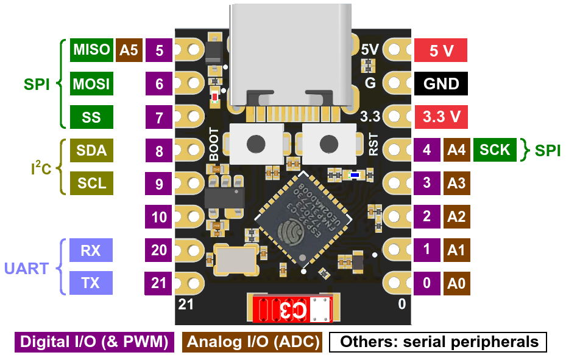

# How to Guide to use Micropython with esp32-c3 super mini plus 

FYI: [MicroPython](https://micropython.org/) is a lean and efficient implementation of the Python 3 programming language that includes a small subset of the Python standard library and is optimized to run on microcontrollers (esp32-c3, etc.) and in constrained environments.

MicroPython documentation for esp32: https://docs.micropython.org/en/latest/esp32/quickref.html

> **NOTE**
> A [pyboard](https://store.micropython.org/product/PYBLITEv1.0H) is available and is packaged for demo purposes as 3 different colors: [gold](https://store.micropython.org/product/KIT-START1N), [red](https://store.micropython.org/product/KIT-START1R), [purple](https://store.micropython.org/product/KIT-START1P) where you can plug a USB-C cable, microSD card and use the 24 GPIO.

To design on a breadboard your circuits, refer to the following image to connect the cables to the GPIO 0 to 21



## Prerequisite

To interact with the board connected using the USB-C cable to a laptop, it is needed to install some tools on your machine able to copy the files, execute them or when this is need to flash a new firmware, etc.

- [esp32-C3 super mini plus](https://www.tinytronics.nl/en/development-boards/microcontroller-boards/with-wi-fi/esp32-c3-supermini-plus-development-board-with-soldered-headers) with MicroPython [firmware](https://micropython.org/download/ESP32_GENERIC_C3/) installed
- usb-c cable
- breadboard and [electronic kit](https://github.com/Freenove/Freenove_Ultimate_Starter_Kit_for_Raspberry_Pi/blob/master/List_Ultimate_RPi_Kit.jpg)

Verify if the following tools: `uv` or `cargo-binstall` are well installed first
```bash
brew install uv // Python package and project manager, written in Rust
curl https://sh.rustup.rs -sSf | sh // Rust & Package manager
brew install cargo-binstall // Too to install Rust binaries
```
Next, create first a python virtual environment within the project where you will develop the code
```bash
uv venv
source .venv/bin/activate.fish
```
and install the tools:
```shell
uv tool install mpremote

# Optional
uv tool install esptool
cargo binstall espflash
uv tool install mpy-cross // Cross-compiler able to pre-compile python files into bytecode (= mpy files)
```

## How to interact with the board and MicroPython

There are two options available to interact with the board depending on if you prefer to use a terminal and execute commands - option A or to use an IDE as IntelliJ, PyCharm, VS Code and plugins.

### Option A - Use MicroPython remote tool - mpremote

To figure out the device to use to connect to, execute this command:
```shell
❯ mpremote connect list
/dev/cu.Bluetooth-Incoming-Port None 0000:0000 None None
/dev/cu.debug-console None 0000:0000 None None
/dev/cu.usbmodem101 18:8B:0E:93:18:88 303a:1001 Espressif USB JTAG/serial debug unit
```

We can copy the Python file(s) from the local project to the microcontroller using the command:
```shell
mpremote connect /dev/cu.<DEVICE> cp blink.py :blink.py
```
and next launch it using
```shell
mpremote connect /dev/cu.<DEVICE> run blink.py
```
If you want to both upload and run in one go:
```shell
mpremote connect /dev/cu.<DEVICE> cp main.py :main.py + run main.py
```

To copy all the `*.py` files to the board:
```bash
for f in *.py; mpremote connect /dev/cu.<DEVICE> cp $f :$f; end
```

To open Python `REPL`
```shell
mpremote connect /dev/cu.<DEVICE>
```

### Option B - Install the MicroPython Tools plugin on PyCharm

Download PyCharm (Community or Professional) from https://www.jetbrains.com/pycharm/. Then add the MicroPython plugin:

1. Open **Settings → Plugins → Marketplace**
2. Search **"MicroPython"** (by JetBrains) and install it
3. Restart PyCharm
4. Open **Settings → Languages & Frameworks → MicroPython**
5. Check **"Enable MicroPython support"**
6. Set device type to **ESP32** and select the serial port

To connect to the board and execute a script using `REPL`, execute the following commands:

1. Open the **MicroPython** tool window (**View → Tool Windows → MicroPython**)
2. The REPL connects automatically if the port is configured. Otherwise, click on the `connect` button
3. To upload a file: right-click on the py file and select: **Upload to Micropython device**
4. Next, to execute code using `REPL`, right-click on the py file and select:  **Execute file in REPL**

## Say Hello using REPL

- Connect to the board and launch REPL. 
- Type next the following code:
```python
print("Hello from ESP32-C3!")
```
to see as message:
```bash
mpremote connect /dev/cu.usbmodem101
Connected to MicroPython at /dev/cu.usbmodem101
Use Ctrl-] or Ctrl-x to exit this shell

>>> print("Hello from ESP32-C3!")
Hello from ESP32-C3!
```

## Tutorials

See: [TUTORIALS.md](TUTORIALS.md)

## Flash MicroPython firmware (optional)

1. Download the latest MicroPython firmware for ESP32-C3 from https://micropython.org/download/ESP32_GENERIC_C3/ and read from this page the installation instructions !
2. Plug in the ESP32-C3 Super Mini via USB-C. Hold the **BOOT** button while plugging in if the port doesn't appear.
3. Erase the flash:
   ```bash
   esptool --chip esp32c3 --port /dev/cu.usbmodem101 erase_flash
   ```
4. Flash MicroPython (replace the `.bin` filename with the one you downloaded):
   ```bash
   esptool --chip esp32c3 --port /dev/cu.usbmodem101 write_flash -z 0x0 firmware/ESP32_GENERIC_C3-20260824-v1.29.0.bin
   ```

Alternatively, use the following Rust tool - https://github.com/esp-rs/espflash/tree/main/espflash able to erase, flash but not only (see help):

```bash
// Fetch the latest firmware version locally
set ESP_VERSION 20260824-v1.29.0
wget https://micropython.org/resources/firmware/ESP32_GENERIC_C3-$ESP_VERSION.bin -O firmware/ESP32_GENERIC_C3-$ESP_VERSION.bin

// to flash
espflash write-bin --chip esp32c3 --port /dev/cu.usbmodem101 0x0 firmware/ESP32_GENERIC_C3-$ESP_VERSION.bin

// to erase
espflash erase-flash --chip esp32c3 --port /dev/cu.usbmodem101
```

**Note**: `espflash flash` expects an ELF binary (from a Rust/C ESP-IDF build), not a raw .bin. For MicroPython `.bin` firmware, use espflash write-bin which writes a raw binary to a specific flash address (0x0 for ESP32-C3 MicroPython).

## Optimization: native build

Read: https://www.luisllamas.es/en/micropython-optimization-native-viper/

- To create bytecode of some functions, add `@micropython.native` before a function of a Python file:

```python
button = Pin(PIN_BUTTON, Pin.IN, Pin.PULL_UP)

@micropython.native
def check_button():
    while True:
        if button.value() == 0:
            print("Button pressed!")
            time.sleep(0.3)

print("Waiting for to press the button...")
check_button()
```
- Next, compile it to create a `mpy` file and deploy it

```bash
# For ESP32-C3 (RISC-V)
mpy-cross -march=rv32imc your_file.py
```

This produces `your_file.mpy` in the same directory.

- Deploy `.mpy` to the device

```bash
# Upload the compiled file
mpremote connect /dev/cu.usbmodem101 cp your_file.mpy :your_file.mpy

# For libraries, put them in /lib
mpremote connect /dev/cu.usbmodem101 mkdir :lib
mpremote connect /dev/cu.usbmodem101 cp my_module.mpy :lib/my_module.mpy
```

MicroPython automatically prefers `.mpy` over `.py` if both exist with the same name.

### Version compatibility

**Important:** the `mpy-cross` version must match the MicroPython firmware version on your device. Check with:

```bash
# On your computer
mpy-cross --version
# Example output: MicroPython v1.24.1 mpy-cross emitting mpy v6.3

# On the device (via REPL)
mpremote connect /dev/cu.usbmodem101 exec "import sys; print(sys.version, sys.implementation)"
```

If there's a mismatch, install a specific version:

```bash
uv install tool mpy-cross==1.24.1
```

### Architecture reference

| Board                      | `-march=` flag |
| -------------------------- | -------------- |
| ESP32                      | `xtensawin`    |
| ESP32-S2                   | `xtensawin`    |
| ESP32-S3                   | `xtensawin`    |
| **ESP32-C3**               | **`rv32imc`**  |
| ESP32-C6                   | `rv32imc`      |
| Raspberry Pi Pico (RP2040) | `armv6m`       |
| Pico 2 (RP2350)            | `armv6m`       |

### Optimization levels

```bash
# Default (no optimization)
mpy-cross -march=rv32imc main.py

# Optimize (remove assert statements, set __debug__ = False)
mpy-cross -O1 -march=rv32imc main.py

# More aggressive (also remove docstrings)
mpy-cross -O2 -march=rv32imc main.py
```

### Full example workflow

```bash
# Compile all .py files in your project
for f in boot.py main.py config.py; do
    mpy-cross -march=rv32imc -O1 "$f"
done

# Upload all .mpy files
PORT=/dev/cu.usbmodem101
for f in *.mpy; do
    mpremote connect $PORT cp "$f" :"$f"
done

# Reset the device to run the new code
mpremote connect $PORT reset
```

