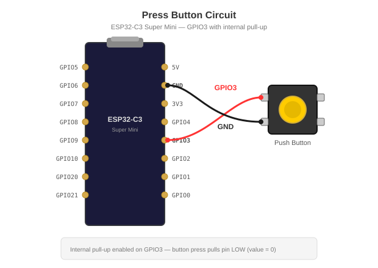
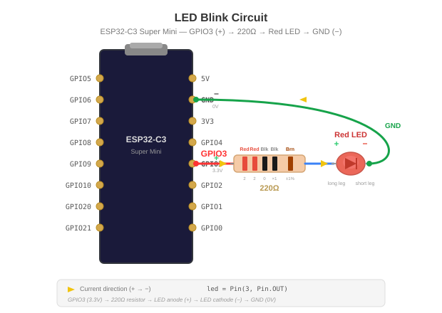

## How to Guide to use Micropython

FYI: [MicroPython](https://micropython.org/) is a lean and efficient implementation of the Python 3 programming language that includes a small subset of the Python standard library and is optimized to run on microcontrollers (esp32-c3, etc.) and in constrained environments.

MicroPython documentation for esp32: https://docs.micropython.org/en/latest/esp32/quickref.html

> **NOTE**
> A [pyboard](https://store.micropython.org/product/PYBLITEv1.0H) is available and is packaged for demo purposes as 3 different colors: [gold](https://store.micropython.org/product/KIT-START1N), [red](https://store.micropython.org/product/KIT-START1R), [purple](https://store.micropython.org/product/KIT-START1P) where you can plug a USB-C cable, microSD card and use the 24 GPIO.

### Prerequisite

Verify if the following tools: `uv` or `cargo-binstall` are well installed first
```bash
brew install uv // Python package and project manager, written in Rust
curl https://sh.rustup.rs -sSf | sh // Rust & Package manager
brew install cargo-binstall // Too to install Rust binaries
```
Next, create first a python virtual environment within the project where you will develop the code
```bash
uv venv
source .venv/bin/activate.fish
```
and install the tools:
```shell
uv tool install mpremote

# Optional
uv tool install esptool
cargo binstall espflash
uv tool install mpy-cross // Cross-compiler able to pre-compile python files into bytecode (= mpy files)
```

### Option A - Use MicroPython remote tool - mpremote

We can copy the Python file(s) from the local project to the microcontroller using the command:
```shell
mpremote cp blink.py :blink.py
```
and next launch it using
```shell
mpremote run blink.py
```
If you want to both upload and run in one go:
```shell
mpremote connect /dev/cu.usbmodem101 cp main.py :main.py + run main.py
```

To copy all the `*.py` files to the board:
```bash
for f in *.py; mpremote connect /dev/cu.usbmodem101 cp $f :$f; end
```

To open Python `REPL`
```shell
mpremote connect /dev/cu.usbmodem101
```

### Option B - Install the MicroPython Tools plugin on PyCharm

Download PyCharm (Community or Professional) from https://www.jetbrains.com/pycharm/. Then add the MicroPython plugin:

1. Open **Settings → Plugins → Marketplace**
2. Search **"MicroPython"** (by JetBrains) and install it
3. Restart PyCharm
4. Open **Settings → Languages & Frameworks → MicroPython**
5. Check **"Enable MicroPython support"**
6. Set device type to **ESP32** and select the serial port

#### Connect to the board

1. Open the **MicroPython** tool window (**View → Tool Windows → MicroPython**)
2. The REPL connects automatically if the port is configured. Otherwise, click on the `connect` button
3. To upload a file: right-click on the py file and select: **Upload to Micropython device**
4. Next, to execute code using `REPL`, right-click on the py file and select:  **Execute file in REPL**

### Say Hello using REPL

- Connect to the board and launch REPL. 
- Type next the following code:
```python
print("Hello from ESP32-C3!")
```
to see as message:
```bash
mpremote connect /dev/cu.usbmodem101
Connected to MicroPython at /dev/cu.usbmodem101
Use Ctrl-] or Ctrl-x to exit this shell

>>> print("Hello from ESP32-C3!")
Hello from ESP32-C3!
```

## Tutorials

### Test internal led on/off

Create the file `blink.py` and add the code:

```python
from machine import Pin
import time

led = Pin(8, Pin.OUT)
print("Blink started")

while True:
    print(f"Led ON for 2s ...")
    led.value(0)   # LED ON (active LOW on this board)
    time.sleep(2)
    print(f"Led OFF for 2s ...")
    led.value(1)   # LED OFF
    time.sleep(2)
```
Next, run it using `REPL` as explained before and verify that the board led (color blue) is blinking.

### Push button

Schema: 

Code:

```python
from machine import Pin
import time

PIN_BUTTON = 3

button = Pin(PIN_BUTTON, Pin.IN, Pin.PULL_UP)

@micropython.native
def check_button():
    while True:
        if button.value() == 0:
            print("Button pressed!")
            time.sleep(0.3)

print("Waiting for to press the button...")
check_button()
```

### Red Led loop

```
  ESP32-C3 Super Mini

  GPIO3 (+) ────> 220Ω (red - red - black - black - brown) ────> Long pin (+) - LED - Small pin (-) ────> GND
```

Schema: 

Code:
```python
from machine import Pin
import time

led = Pin(3, Pin.OUT)

while True:
    print("Change led value from 0 to 1 - ON ...")
    led.value(1)
    print("Sleep 3s ...")
    time.sleep(3)
    print("Change led value from 1 to 0 - OFF ...")
    led.value(0)
    print("Sleep 3s ...")
    time.sleep(3)
```


### Led and push button


TODO: To be reviewed !!

```
  ESP32-C3 Super Mini

  GPIO7 ──── 220Ω ──── LED(+) ──── GND

  GPIO3 ──── Button pin 1
             Button pin 2 ──────── GND  (button pulls to ground)
```

Code:

```python
from machine import Pin
import time

led = Pin(7, Pin.OUT)
button = Pin(3, Pin.IN, Pin.PULL_UP)

while True:
    if button.value() == 0:
        led.value(1)
        print("Button pressed — LED ON")
    else:
        led.value(0)
    time.sleep_ms(50)
```
