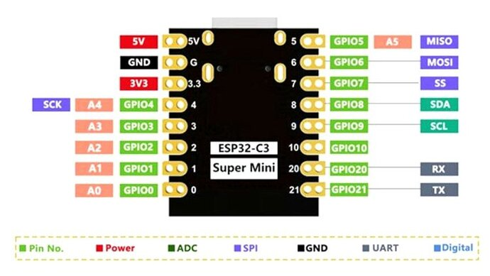

# ESP32-C3 Super Mini — Breadboard Tutorial

A step-by-step beginner project using the **ESP32-C3 Super Mini** and components from the **Freenove FNK0020 kit**. Each step builds on the previous one.

This tutorial provides code in both **C++ (Arduino)** and **MicroPython** — pick whichever you prefer and stick with it through all steps.

## What you need

**From the FNK0020 kit:**
- 1× breadboard (830-point)
- 3× LEDs (red, green, blue)
- 3× 220Ω resistors (red-red-brown)
- 1× 10kΩ resistor (brown-black-orange)
- 1× push button (tactile switch)
- 1× active buzzer
- 1× thermistor (NTC 10kΩ) or DHT11 sensor
- Jumper wires (male-to-male)

**Not in the kit (buy separately):**
- 1× ESP32-C3 Super Mini (~€3, AliExpress or Amazon)
- 1× USB-C cable (for programming and power)

## ESP32-C3 Super Mini Pinout



**Safe pins for this tutorial:** GPIO0, GPIO1, GPIO3, GPIO4, GPIO5, GPIO10

## Step 0: Set up your development environment

Choose **one** of the two options below.

### Option A: Arduino IDE (C++)

#### 0.1 Install Arduino IDE

Download from https://www.arduino.cc/en/software (version 2.x).

#### 0.2 Add ESP32 board support

1. Open **File → Preferences**
2. In "Additional Board Manager URLs", paste:
   ```
   https://espressif.github.io/arduino-esp32/package_esp32_index.json
   ```
3. Click OK
4. Open **Tools → Board → Boards Manager**
5. Search `esp32`, install **"esp32 by Espressif Systems"** (version 3.x)

#### 0.3 Select the board

1. Plug in the ESP32-C3 Super Mini via USB-C
2. **Tools → Board → esp32 → ESP32C3 Dev Module**
3. **Tools → Port** → select the port that appeared (e.g., `/dev/cu.usbmodem...` on Mac)
4. **Tools → USB CDC On Boot → Enabled** (important for serial output!)

#### 0.4 Test the connection

1. Open **Tools → Serial Monitor**, set baud rate to **115200**
2. Press the RST button on the board — you should see boot messages

### Option B: MicroPython

#### 0.1 Install PyCharm + MicroPython plugin

Download PyCharm (Community or Professional) from https://www.jetbrains.com/pycharm/. Then add the MicroPython plugin:

1. Open **Settings → Plugins → Marketplace**
2. Search **"MicroPython"** (by JetBrains) and install it
3. Restart PyCharm
4. Open **Settings → Languages & Frameworks → MicroPython**
5. Check **"Enable MicroPython support"**
6. Set device type to **ESP32** and select the serial port

#### 0.2 Flash MicroPython firmware

1. Download the latest MicroPython firmware for ESP32-C3 from https://micropython.org/download/ESP32_GENERIC_C3/
2. Install `esptool`:
   ```bash
   pip install esptool
   ```
3. Plug in the ESP32-C3 Super Mini via USB-C. Hold the **BOOT** button while plugging in if the port doesn't appear.
4. Erase the flash:
   ```bash
   esptool.py --chip esp32c3 --port /dev/cu.usbmodem... erase_flash
   ```
5. Flash MicroPython (replace the `.bin` filename with the one you downloaded):
   ```bash
   esptool.py --chip esp32c3 --port /dev/cu.usbmodem... write_flash -z 0x0 ESP32_GENERIC_C3-20250415-v1.25.0.bin
   ```

#### 0.3 Connect to the board

1. Open the **MicroPython** tool window (**View → Tool Windows → MicroPython**)
2. The REPL connects automatically if the port is configured
3. To upload a file: right-click it → **Run 'Flash ...'**

#### 0.4 Test the connection

Type in the REPL (PyCharm MicroPython tool window):
```python
print("Hello from ESP32-C3!")
```

You should see the output immediately. MicroPython files are saved as `main.py` on the board (runs automatically at boot) or executed directly from PyCharm.

---

## Step 1: Blink the onboard LED

No wiring needed — just the ESP32-C3 plugged into USB.

### Code (C++ / Arduino)

Create a new sketch, paste this, and click Upload (→ button):

```cpp
const int LED_PIN = 8;

void setup() {
  pinMode(LED_PIN, OUTPUT);
  Serial.begin(115200);
  Serial.println("Blink started");
}

void loop() {
  digitalWrite(LED_PIN, LOW);   // LED ON (active LOW on this board)
  delay(500);
  digitalWrite(LED_PIN, HIGH);  // LED OFF
  delay(500);
}
```

### Code (MicroPython)

Save this as `main.py` on the board (or run it from Thonny):

```python
from machine import Pin
import time

led = Pin(8, Pin.OUT)
print("Blink started")

while True:
    led.value(0)   # LED ON (active LOW on this board)
    time.sleep(0.5)
    led.value(1)   # LED OFF
    time.sleep(0.5)
```

### What you should see

The blue onboard LED blinks every half second. "Blink started" appears in the Serial Monitor (Arduino) or PyCharm REPL (MicroPython).

### What you learned

- **C++:** `pinMode()` configures a pin; `digitalWrite()` sets it HIGH or LOW
- **MicroPython:** `Pin(num, Pin.OUT)` configures a pin; `pin.value(0/1)` sets it LOW or HIGH
- The onboard LED is **active LOW** — LOW turns it ON, HIGH turns it OFF
- **C++** uses `delay(ms)`; **MicroPython** uses `time.sleep(seconds)` or `time.sleep_ms(ms)`

---

## Step 2: External LED with resistor

### Wiring


```
Breadboard layout:

  ESP32-C3 Super Mini (plugged into breadboard)
  
  GPIO3 ───── 220Ω resistor ───── LED (long leg = anode) ───── GND
                                       (short leg = cathode)
```

Step by step:
1. Plug the ESP32-C3 Super Mini into the breadboard, straddling the center gap
2. Place a **red LED** on the breadboard — note the legs:
   - **Long leg** = anode (+)
   - **Short leg** = cathode (−)
3. Connect a **220Ω resistor** (red-red-brown) from **GPIO3** to the LED's **long leg**
4. Connect the LED's **short leg** to the **GND** rail
5. Connect a jumper from the ESP32's **GND pin** to the breadboard's **GND rail** (blue line)

### Code (C++ / Arduino)

```cpp
const int EXTERNAL_LED = 3;

void setup() {
  pinMode(EXTERNAL_LED, OUTPUT);
}

void loop() {
  digitalWrite(EXTERNAL_LED, HIGH);  // LED ON
  delay(1000);
  digitalWrite(EXTERNAL_LED, LOW);   // LED OFF
  delay(1000);
}
```

### Code (MicroPython)

```python
from machine import Pin
import time

led = Pin(3, Pin.OUT)

while True:
    led.value(1)  # LED ON
    time.sleep(1)
    led.value(0)  # LED OFF
    time.sleep(1)
```

### What you learned

- LEDs need a **current-limiting resistor** (220Ω) to avoid burning out
- Without the resistor, the LED draws too much current → burns out instantly
- The resistor value is calculated: R = (3.3V − 2V) / 0.015A ≈ 87Ω (220Ω is safe and standard)

---

## Step 3: Button controls the LED

### Wiring


```
  ESP32-C3 Super Mini

  GPIO3 ──── 220Ω ──── LED(+) ──── GND

  GPIO1 ──── Button pin 1
             Button pin 2 ──────── GND  (button pulls to ground)
```

Step by step:
1. Keep the LED wiring from Step 2
2. Place a **push button** on the breadboard (it straddles the center gap)
3. Connect one side of the button to **GPIO1**
4. Connect the other side to **GND**
5. No external pull-up resistor needed — we use the ESP32's internal one

### Code (C++ / Arduino)

```cpp
const int LED_PIN = 3;
const int BUTTON_PIN = 1;

void setup() {
  pinMode(LED_PIN, OUTPUT);
  pinMode(BUTTON_PIN, INPUT_PULLUP);
  Serial.begin(115200);
}

void loop() {
  int buttonState = digitalRead(BUTTON_PIN);

  if (buttonState == LOW) {
    digitalWrite(LED_PIN, HIGH);
    Serial.println("Button pressed — LED ON");
  } else {
    digitalWrite(LED_PIN, LOW);
  }

  delay(50);
}
```

### Code (MicroPython)

```python
from machine import Pin
import time

led = Pin(3, Pin.OUT)
button = Pin(1, Pin.IN, Pin.PULL_UP)

while True:
    if button.value() == 0:
        led.value(1)
        print("Button pressed — LED ON")
    else:
        led.value(0)
    time.sleep_ms(50)
```

### What you learned

- **C++:** `INPUT_PULLUP` enables the internal pull-up resistor (~45kΩ)
- **MicroPython:** `Pin.PULL_UP` as the third argument does the same
- When button is **not pressed**: GPIO reads HIGH (pulled to 3.3V internally)
- When button is **pressed**: GPIO reads LOW (connected to GND through button)
- This is why pressed = LOW (counterintuitive but standard)
- The 50ms delay is a simple **debounce** — prevents the button from registering multiple presses

---

## Step 4: Add a buzzer

### Wiring


```
  ESP32-C3 Super Mini

  GPIO3 ──── 220Ω ──── LED(+) ──── GND        (same as before)
  GPIO1 ──── Button ──── GND                    (same as before)
  GPIO4 ──── Buzzer (+) ──── GND                (active buzzer)
```

Step by step:
1. Keep all wiring from Step 3
2. Place the **active buzzer** on the breadboard
   - The buzzer has a (+) marking or a longer pin — connect that to **GPIO4**
   - Connect the other pin to **GND**

### Code (C++ / Arduino)

```cpp
const int LED_PIN = 3;
const int BUTTON_PIN = 1;
const int BUZZER_PIN = 4;

void setup() {
  pinMode(LED_PIN, OUTPUT);
  pinMode(BUTTON_PIN, INPUT_PULLUP);
  pinMode(BUZZER_PIN, OUTPUT);
  Serial.begin(115200);
}

void loop() {
  int buttonState = digitalRead(BUTTON_PIN);

  if (buttonState == LOW) {
    // Button pressed: LED on + buzzer beeps
    digitalWrite(LED_PIN, HIGH);
    digitalWrite(BUZZER_PIN, HIGH);
    delay(100);
    digitalWrite(BUZZER_PIN, LOW);
    delay(100);
  } else {
    digitalWrite(LED_PIN, LOW);
    digitalWrite(BUZZER_PIN, LOW);
  }
}
```

### Code (MicroPython)

```python
from machine import Pin
import time

led = Pin(3, Pin.OUT)
button = Pin(1, Pin.IN, Pin.PULL_UP)
buzzer = Pin(4, Pin.OUT)

while True:
    if button.value() == 0:
        led.value(1)
        buzzer.value(1)
        time.sleep_ms(100)
        buzzer.value(0)
        time.sleep_ms(100)
    else:
        led.value(0)
        buzzer.value(0)
```

### What you learned

- An **active buzzer** has a built-in oscillator — just give it power (HIGH) and it beeps
- A **passive buzzer** needs a frequency signal (C++: `tone()`, MicroPython: `PWM`) — check which one your kit has
- Rapid on/off creates an alarm pattern

---

## Step 5: Read temperature (thermistor)

This is where it connects to your weather station project!

### Wiring


```
  ESP32-C3 Super Mini

  3V3 ──── 10kΩ resistor ──┬──── Thermistor ──── GND
                            │
                          GPIO0  (ADC read point = voltage divider midpoint)

  GPIO3 ──── 220Ω ──── LED(+) ──── GND
  GPIO1 ──── Button ──── GND
  GPIO4 ──── Buzzer(+) ──── GND
```

Step by step:
1. Keep all previous wiring
2. Connect a **10kΩ resistor** from the **3V3 pin** to a new breadboard row
3. Connect the **thermistor** from that same row to **GND**
4. Connect **GPIO0** to the junction (the row where resistor meets thermistor)

This creates a **voltage divider**: as temperature changes, the thermistor's resistance changes, which changes the voltage at GPIO0.

### Code (C++ / Arduino)

```cpp
#include <math.h>

const int LED_PIN = 3;
const int BUTTON_PIN = 1;
const int BUZZER_PIN = 4;
const int THERM_PIN = 0;

const float SERIES_RESISTOR = 10000.0;
const float NOMINAL_RESISTANCE = 10000.0;
const float NOMINAL_TEMP = 25.0;
const float B_COEFFICIENT = 3950.0;

float readTemperature() {
  int adcValue = analogRead(THERM_PIN);
  float voltage = adcValue / 4095.0;
  float resistance = SERIES_RESISTOR * (1.0 / voltage - 1.0);

  // Steinhart-Hart (simplified B-parameter equation)
  float tempK = 1.0 / (
    1.0 / (NOMINAL_TEMP + 273.15) +
    (1.0 / B_COEFFICIENT) * log(resistance / NOMINAL_RESISTANCE)
  );

  return tempK - 273.15;
}

void setup() {
  pinMode(LED_PIN, OUTPUT);
  pinMode(BUTTON_PIN, INPUT_PULLUP);
  pinMode(BUZZER_PIN, OUTPUT);
  analogReadResolution(12);
  Serial.begin(115200);
  Serial.println("Mini Weather Station started!");
}

void loop() {
  float tempC = readTemperature();

  Serial.print("Temperature: ");
  Serial.print(tempC, 1);
  Serial.println(" °C");

  // Visual feedback: LED on if temp > 25°C
  if (tempC > 25.0) {
    digitalWrite(LED_PIN, HIGH);
  } else {
    digitalWrite(LED_PIN, LOW);
  }

  // Alarm: buzzer if temp > 30°C
  if (tempC > 30.0) {
    digitalWrite(BUZZER_PIN, HIGH);
    delay(200);
    digitalWrite(BUZZER_PIN, LOW);
  }

  // Button: press to get instant reading
  if (digitalRead(BUTTON_PIN) == LOW) {
    Serial.println(">>> MANUAL READ <<<");
    Serial.print("Temperature: ");
    Serial.print(tempC, 1);
    Serial.println(" °C");
    delay(500);
  }

  delay(2000);
}
```

### Code (MicroPython)

```python
from machine import Pin, ADC
import math
import time

led = Pin(3, Pin.OUT)
button = Pin(1, Pin.IN, Pin.PULL_UP)
buzzer = Pin(4, Pin.OUT)
therm = ADC(Pin(0))
therm.atten(ADC.ATTN_11DB)  # full 0–3.3V range

SERIES_RESISTOR = 10000.0
NOMINAL_RESISTANCE = 10000.0
NOMINAL_TEMP = 25.0
B_COEFFICIENT = 3950.0

def read_temperature():
    adc_value = therm.read()
    voltage = adc_value / 4095.0
    if voltage == 0:
        return 0.0
    resistance = SERIES_RESISTOR * (1.0 / voltage - 1.0)

    # Steinhart-Hart (simplified B-parameter equation)
    temp_k = 1.0 / (
        1.0 / (NOMINAL_TEMP + 273.15) +
        (1.0 / B_COEFFICIENT) * math.log(resistance / NOMINAL_RESISTANCE)
    )
    return temp_k - 273.15

print("Mini Weather Station started!")

while True:
    temp_c = read_temperature()
    print("Temperature: {:.1f} °C".format(temp_c))

    led.value(1 if temp_c > 25.0 else 0)

    if temp_c > 30.0:
        buzzer.value(1)
        time.sleep_ms(200)
        buzzer.value(0)

    if button.value() == 0:
        print(">>> MANUAL READ <<<")
        print("Temperature: {:.1f} °C".format(temp_c))
        time.sleep_ms(500)

    time.sleep(2)
```

### What you learned

- **Voltage divider**: two resistors in series split the voltage — the midpoint voltage depends on the ratio of resistances
- **Thermistor**: a resistor whose value changes with temperature (NTC = resistance goes DOWN as temperature goes UP)
- **ADC (Analog-to-Digital Converter)**: reads voltage as a number (0–4095 for 12-bit). 0 = 0V, 4095 = 3.3V
  - **C++:** `analogRead(pin)` returns the raw value; `analogReadResolution(12)` sets 12-bit mode
  - **MicroPython:** `ADC(Pin(num))` creates the ADC; `.atten(ADC.ATTN_11DB)` sets the full 0–3.3V range; `.read()` returns the value
- **Steinhart-Hart equation**: converts thermistor resistance to temperature in °C
- This is the same concept your weather station uses, except the BME280 does this internally with much better accuracy

---

## Step 6: Read temperature & humidity (DHT11)

This step is **standalone** — you only need the ESP32-C3, a DHT11 sensor, a 10kΩ resistor, and jumper wires. No LED, button, or buzzer required.

The DHT11 is a digital sensor that measures both **temperature and humidity**. Unlike the thermistor in Step 5, it sends data as a serial bit stream — no voltage divider math needed.

### What you need for this step

- 1× ESP32-C3 Super Mini (plugged into breadboard)
- 1× DHT11 sensor (4-pin component or 3-pin module)
- 1× 10kΩ resistor (brown-black-orange) — only if using the bare 4-pin sensor
- 3× jumper wires

### References

- https://newbiely.com/tutorials/esp32-c3/esp32-c3-super-mini-dht11
- https://docs.freenove.com/projects/fnk0054/en/latest/fnk0054/codes/c&py/20_Hygrothermograph_DHT11.html#python-code-20-1-dht11

### Wiring


```
  ESP32-C3 Super Mini

  3V3 ──┬──── DHT11 pin 1 (VCC)
        │
       10kΩ  (pull-up resistor)
        │
  GPIO5 ┴──── DHT11 pin 2 (DATA)
              DHT11 pin 3 (NC)        not connected
  GND ─────── DHT11 pin 4 (GND)
```

Step by step:
1. Place the **DHT11** on the breadboard — identify the pins (facing the grid side):
   - **Pin 1** (leftmost) = VCC
   - **Pin 2** = DATA
   - **Pin 3** = NC (not connected)
   - **Pin 4** (rightmost) = GND
2. Connect **pin 1** (VCC) to the **3V3** rail
3. Connect **pin 4** (GND) to the **GND** rail
4. Connect **pin 2** (DATA) to **GPIO5**
5. Place a **10kΩ resistor** between **pin 2** (DATA) and the **3V3** rail — this is a pull-up that keeps the data line HIGH when idle

> **3-pin DHT11 module?** If your DHT11 is on a small PCB with 3 pins (VCC, DATA, GND), skip the 10kΩ resistor — it's already built in. Connect VCC → 3V3, DATA → GPIO5, GND → GND.

### Installing the DHT library (C++ only)

In Arduino IDE:
1. Open **Tools → Manage Libraries...**
2. Search for **"DHT sensor library"** by Adafruit
3. Click **Install** — also install **"Adafruit Unified Sensor"** when prompted

MicroPython has the `dht` module built in — no installation needed.

### Code (C++ / Arduino)

```cpp
#include "DHT.h"

const int DHT_PIN = 5;

DHT dht(DHT_PIN, DHT11);

void setup() {
  Serial.begin(115200);
  dht.begin();
  Serial.println("DHT11 sensor started!");
}

void loop() {
  float humidity = dht.readHumidity();
  float tempC = dht.readTemperature();

  if (isnan(humidity) || isnan(tempC)) {
    Serial.println("Failed to read from DHT11!");
    delay(2000);
    return;
  }

  Serial.print("Temperature: ");
  Serial.print(tempC, 1);
  Serial.print(" *C  |  Humidity: ");
  Serial.print(humidity, 1);
  Serial.println(" %");

  delay(2000);
}
```

### Code (MicroPython)

```python
from machine import Pin
import dht
import time

sensor = dht.DHT11(Pin(5))

print("DHT11 sensor started!")

while True:
    try:
        sensor.measure()
        temp_c = sensor.temperature()
        humidity = sensor.humidity()
        print("Temperature: {} *C  |  Humidity: {} %".format(temp_c, humidity))
    except OSError:
        print("Failed to read from DHT11!")

    time.sleep(2)
```

### What you should see

The Serial Monitor (Arduino) or REPL (MicroPython) prints temperature and humidity every 2 seconds:

```
DHT11 sensor started!
Temperature: 23.0 *C  |  Humidity: 45.0 %
Temperature: 23.0 *C  |  Humidity: 46.0 %
```

Breathe on the sensor — you should see humidity jump up within a few readings.

### What you learned

- **DHT11** is a **digital sensor** — it sends 40 bits of data on a single wire, not an analog voltage
- The sensor handles the temperature/humidity conversion internally — no Steinhart-Hart math like the thermistor
- The **10kΩ pull-up resistor** keeps the data line HIGH when idle; both the ESP32 and the sensor pull it LOW to communicate
- **C++:** The Adafruit DHT library handles the timing-critical protocol; `readTemperature()` and `readHumidity()` return floats
- **MicroPython:** The built-in `dht` module handles everything; call `sensor.measure()` first, then read `.temperature()` and `.humidity()` (returns integers)
- DHT11 accuracy: ±2°C temperature, ±5% humidity — good for learning, but the BME280 is better for a real weather station
- The DHT11 needs **at least 1 second** between readings — the 2-second delay ensures reliable measurements

### DHT11 vs Thermistor (Step 5)

| | Thermistor (Step 5) | DHT11 (Step 6) |
|---|---|---|
| **Signal** | Analog (voltage divider) | Digital (single-wire protocol) |
| **Measures** | Temperature only | Temperature + humidity |
| **Math needed** | Steinhart-Hart equation | None (sensor does it) |
| **Accuracy** | ±1°C (after calibration) | ±2°C, ±5% RH |
| **Extra parts** | 10kΩ (voltage divider) | 10kΩ (pull-up) |
| **Best for** | Understanding analog sensors | Getting humidity data easily |

---

## Complete wiring diagram (all steps combined)


```
                        Breadboard
  ┌─────────────────────────────────────────────────────────┐
  │                                                         │
  │   3V3 ────[10kΩ]────┬────[Thermistor]──── GND          │
  │                     │                                   │
  │                   GPIO0                                 │
  │                   (ADC)                                 │
  │                                                         │
  │  GPIO3 ───[220Ω]───[LED +]──── GND                     │
  │                                                         │
  │  GPIO1 ───[Button]──── GND                              │
  │                                                         │
  │  GPIO4 ───[Buzzer +]──── GND                            │
  │                                                         │
  │              ESP32-C3                                    │
  │              Super Mini                                 │
  │              (USB-C up)                                  │
  └─────────────────────────────────────────────────────────┘

  Components used: 4 (LED, button, buzzer, thermistor)
  GPIO pins used:  4 (GPIO0, GPIO1, GPIO3, GPIO4)
  Power:           USB-C (5V from computer)
```

## C++ vs MicroPython — Quick comparison

| | C++ (Arduino) | MicroPython |
|---|---|---|
| **IDE** | Arduino IDE | PyCharm + MicroPython plugin |
| **Upload** | Compile + flash (~10s) | Save file to board (~1s) |
| **Debugging** | Serial Monitor (`Serial.println`) | REPL (interactive `print()`) |
| **Speed** | Compiled, runs at full CPU speed | Interpreted, ~10–100× slower |
| **Memory** | Full 400 KB SRAM available | ~100 KB free after interpreter |
| **Libraries** | Huge Arduino ecosystem | Growing, covers most sensors |
| **Best for** | Production firmware, low-level control, battery life | Rapid prototyping, learning, interactive testing |

For this breadboard tutorial, both work equally well. For the final weather station firmware (deep sleep, MQTT, battery optimization), C++ is the typical choice.

## Troubleshooting

| Problem | Fix |
|---------|-----|
| Upload fails (Arduino) | Hold **BOOT** button while clicking Upload, release after "Connecting..." |
| No serial output (Arduino) | **Tools → USB CDC On Boot → Enabled**, then re-upload |
| Can't connect (MicroPython) | Hold **BOOT** while plugging USB, then re-flash firmware |
| PyCharm REPL shows garbled text | The board still has Arduino firmware — flash MicroPython first |
| PyCharm: no code completion | Ensure MicroPython plugin is installed and enabled for the project |
| LED doesn't light | Check LED polarity (long leg to resistor side) |
| Wrong temperature | Adjust `B_COEFFICIENT` (common values: 3435, 3950, 4100 — check your thermistor) |
| DHT11 returns NaN / fails | Check the 10kΩ pull-up resistor is between DATA and 3V3 (not GND) |
| DHT11 reads 0 / stuck | Ensure at least 2s between readings; power-cycle the sensor |
| DHT11 module (3-pin) fails | Try removing the external pull-up — the module has one built in, doubling up can cause issues |
| Button reads wrong | Make sure button straddles the breadboard center gap |
| Port not visible | Try a different USB-C cable (some are charge-only, no data) |

## Next steps

Once this works, you're ready to:
1. Replace the thermistor with a **BME280** (I2C on GPIO4=SDA, GPIO5=SCL) for accurate temperature, humidity, and pressure
2. Add **Wi-Fi** to send readings over MQTT (as in the weather station project)
3. Move from breadboard to **perfboard** for a permanent build

## References

**General:**
- [ESP32-C3 Super Mini Pinout](https://lastminuteengineers.com/esp32-c3-super-mini-pinout-reference/)
- [ESP32-C3 Super Mini Specs](https://www.espboards.dev/esp32/esp32-c3-super-mini/)
- [Freenove FNK0020 Documentation](https://docs.freenove.com/projects/fnk0020/en/latest/index.html)
- [Freenove DHT11 Tutorial (C)](https://docs.freenove.com/projects/fnk0066/en/latest/fnk0066/codes/c-lang/Hygrothermograph%20DHT11.html)

**C++ / Arduino:**
- [Getting Started with ESP32-C3 Super Mini](https://randomnerdtutorials.com/getting-started-esp32-c3-super-mini/)
- [Arduino-ESP32 Documentation](https://docs.espressif.com/projects/arduino-esp32/en/latest/)

**MicroPython:**
- [MicroPython ESP32-C3 Firmware](https://micropython.org/download/ESP32_GENERIC_C3/)
- [MicroPython Documentation](https://docs.micropython.org/en/latest/)
- [MicroPython ESP32 Quick Reference](https://docs.micropython.org/en/latest/esp32/quickref.html)
- [PyCharm MicroPython Plugin](https://plugins.jetbrains.com/plugin/9777-micropython) — JetBrains official plugin for MicroPython development
- [PyCharm Download](https://www.jetbrains.com/pycharm/)